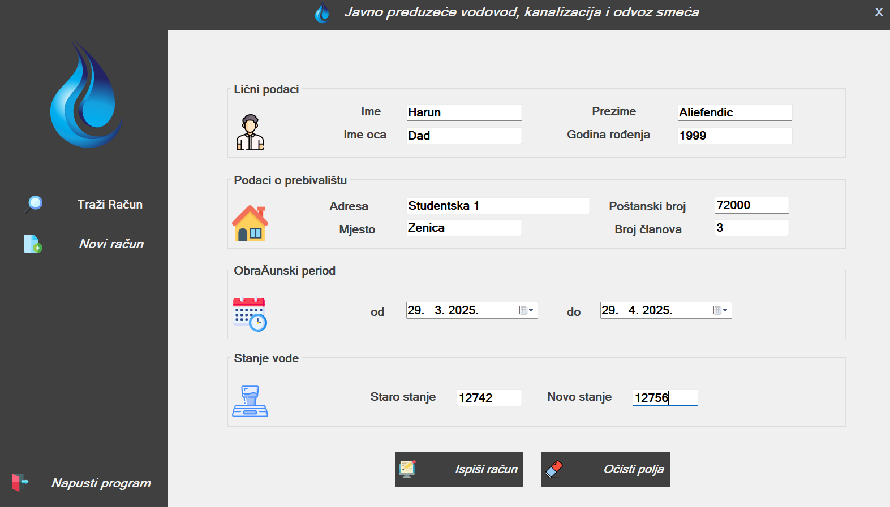
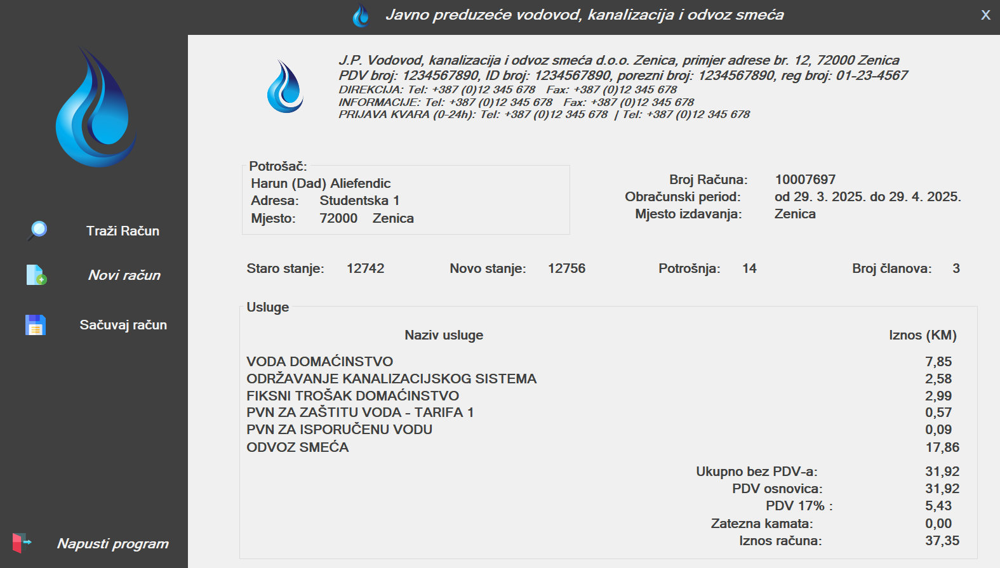
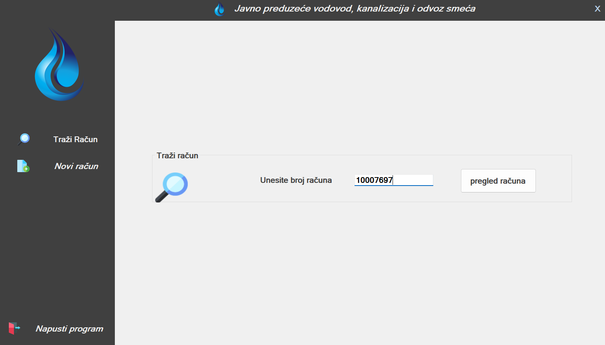

# 💧🚰 WaterSewerApp - C++ Forms Application

A Windows Forms application for water and sewer data management, built with C++/CLI.

## 🚀 Getting Started

### 📋 Prerequisites
- Visual Studio 2019 or later
- .NET Framework 4.7.2 or later
- Windows 10/11

### 🛠️ Building the Application

1. **Clone the repository**
   ```bash
   git clone https://github.com/HFenda/WaterSewerApp-CPP-Forms.git
   cd WaterSewerApp-CPP-Forms
   ```
2. **Open the solution**
   - Double-click WaterSewerApp.sln to open in Visual Studio
3. **Build the application**
   - Select Release configuration
   - Choose x64 platform
   - Build > Build Solution (Ctrl+Shift+B)
4. **Locate the executable**
   - The built .exe will be at:

### ▶️ Running the Application

1. **Navigate to the build directory**
2. **Double-click WaterSewerApp.exe**

## 📚 Development Notes

### 🏗️ Project Structure

```bash
WaterSewerApp/
├── WaterSewerApp.sln       - Solution file
├── WaterSewerApp/          - Main project
│   ├── MyForm.h            - Main form header
│   ├── MyForm.cpp          - Main form implementation
│   ├── MyForm.resx         - Form resources
│   └── stdafx.h            - Precompiled headers
└── README.md               - This documentation
```
## 📸 Application Screens

### 1. 📝 Data Input Form
  
*Form for entering new water/sewer records*

### 2. 🧾 Receipt Output Page
  
*Generated receipt after successful data submission*

### 3. 🔍 Search by Receipt ID
  
*Search functionality to retrieve existing records*

## 📬 Contact

- **LinkedIn**: [Harun Aliefendic](https://www.linkedin.com/in/harun-aliefendic/)
- **Email**: aliefendic.harun.21@size.ba
- **GitHub**: [@HFenda](https://github.com/HFenda)
